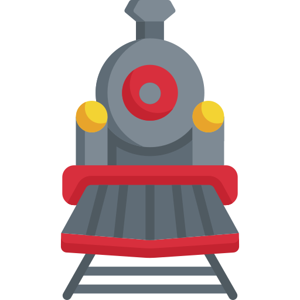

# Turbo::Train



Real-time page updates for your Rails app over SSE with [Mercure](https://mercure.rocks) and [Hotwire Turbo](https://turbo.hotwired.dev/handbook/streams#integration-with-server-side-frameworks).

* **Uses [SSE](https://html.spec.whatwg.org/multipage/server-sent-events.html)**. No more websockets, client libraries, JS code and handling reconnects. Just an HTTP connection. Let the [browser](https://caniuse.com/eventsource) do the work.
* **Seamless Hotwire integration.** Use it exactly like [ActionCable](https://github.com/hotwired/turbo-rails#come-alive-with-turbo-streams). Drop-in replacement for `broadcast_action_to` and usual helpers.
* **Simple.** Get running in minutes, scale easily in production 🚀 

## Before your proceed

Using this gem requires some knowledge of ActionCable and broadcasting turbo streams. Turbo::Train is designed to mimic those, so it is highly recommended to first try the original to understand the concept.

You can start [here](https://hotwired.dev/) and proceed with the [Turbo Handbook](https://turbo.hotwired.dev/handbook/introduction). One of its chapters will be covering [Turbo Streams](https://turbo.hotwired.dev/handbook/streams). Specifically [this section](https://turbo.hotwired.dev/handbook/streams#integration-with-server-side-frameworks) would be the main prerequisite to understanding what this gem is about: it covers [Broadcastable](https://github.com/hotwired/turbo-rails/blob/main/app/models/concerns/turbo/broadcastable.rb) and the overall idea of working with Mercure.

## Prerequisites

1. Rails 7+
2. Mercure server (setup instructions below)

This should also work for Rails 6, but you will also need to install [turbo-rails](https://github.com/hotwired/turbo-rails#installation) manually before this gem.

## Installation

### Step 1. Mercure

Mercure is installed as a plugin to Caddy server. For mac users everything is pretty easy:

```
brew install caddy
```

```
caddy add-package github.com/dunglas/mercure/caddy
```

Now you are ready to run 🚀

```
caddy run
```

### Step 2. Turbo::Train

Instructions for Rails 7+

1. Add the turbo-train gem to your Gemfile: `gem 'turbo-train'`
2. Run `bundle install`
3. Run `rails turbo_train:install`

## Usage

If you are familiar with broadcasting from ActionCable, usage would be extremely familiar:

```
<%# app/views/chat_messages/index.html.erb %>
<%= turbo_train_from "chat_messages" %>
```

And then you can send portions of HTML from your Rails backend to deliver live to all currently open browsers:

```
# app/models/chat_message.rb
after_create_commit { Turbo::Train.broadcast_action_to('chat_messages', action: :append, partial: "chat_message") }
```

You have the same options as original Rails Turbo helpers: rendering partials, pure html, [same actions](https://turbo.hotwired.dev/reference/streams).

## Configuration

To specify different Mercure server settings, please adjust the generated `config/initializers/turbo_train.rb` file:

```
Turbo::Train.configure do |config|
  config.mercure_domain = ...
  config.publisher_key = ...
  config.subscriber_key = ...
end
```

* Your SSE will connect to `https://#{configuration.mercure_domain}/.well-known`. 
* The publisher/subscriber key correspond to the [configuration](https://mercure.rocks/docs/hub/config) or your Mercure server.

By default, these are set to `localhost`/`test`/`testing` to match the configuration of the local development server from the installation instructions above.

***

## License
The gem is available as open source under the terms of the [MIT License](https://opensource.org/licenses/MIT).
